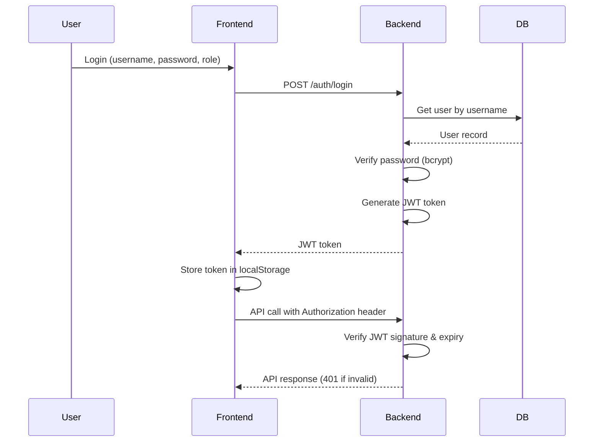
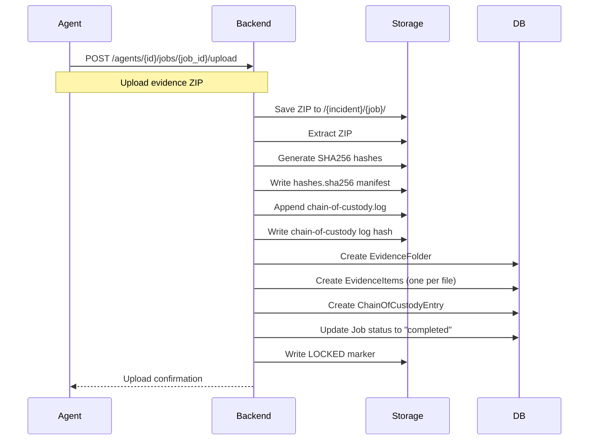
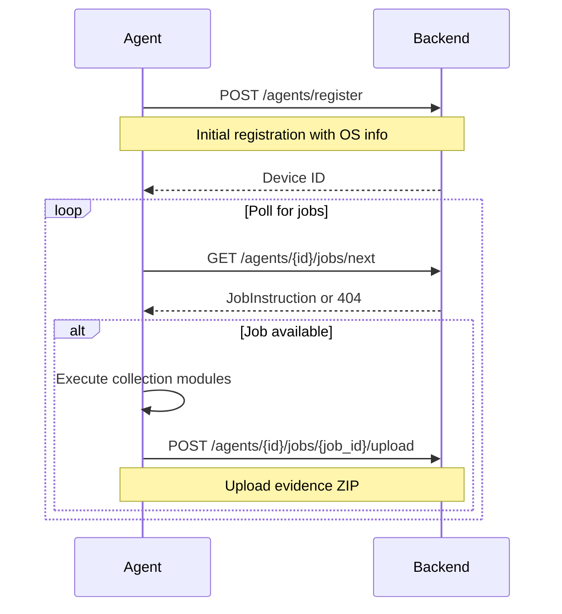

# Architecture Documentation

## System Overview

DFIR Rapid Collection Kit is a three-tier web application designed for secure evidence collection and incident response management.

```
┌──────────────────────────────────────────────────────────────────┐
│                           Presentation Layer                     │
│                      (React Frontend)                        │
│                                                              │
│  ┌──────────────┐  ┌──────────────┐  ┌─────────────────┐│
│  │   Incident   │  │   Evidence   │  │    Agent       ││
│  │ Management   │  │    Vault     │  │  Management     ││
│  └──────────────┘  └──────────────┘  └─────────────────┘│
└────────────────────────────┬─────────────────────────────────┘
                             │ HTTP/REST
                             ▼
┌──────────────────────────────────────────────────────────────────┐
│                           Application Layer                     │
│                      (FastAPI Backend)                        │
│                                                              │
│  ┌──────────────┐  ┌──────────────┐  ┌─────────────────┐│
│  │    Auth      │  │     API      │  │   Evidence     ││
│  │  & JWT       │  │   Router     │  │   Processing   ││
│  └──────────────┘  └──────────────┘  └─────────────────┘│
│                                                              │
│  ┌──────────────────────────────────────────────────────────┐  │
│  │            Business Logic (CRUD Layers)             │  │
│  │  Incidents | Evidence | ChainOfCustody | Jobs        │  │
│  └──────────────────────────────────────────────────────────┘  │
└────────────────────────────┬─────────────────────────────────┘
                             │ Async SQLAlchemy
                             ▼
┌──────────────────────────────────────────────────────────────────┐
│                           Data Layer                         │
│                        (PostgreSQL 16)                       │
│                                                              │
│  ┌──────────────┐  ┌──────────────┐  ┌─────────────────┐│
│  │   Incidents  │  │   Devices    │  │      Jobs      ││
│  │    Users     │  │  Collectors  │  │  Evidence      ││
│  │   Templates  │  │              │  │  ChainOfCustody││
│  └──────────────┘  └──────────────┘  └─────────────────┘│
└──────────────────────────────────────────────────────────────────┘
                              │
                              ▼
┌──────────────────────────────────────────────────────────────────┐
│                       File System                           │
│                   (Evidence Storage)                          │
│                                                              │
│  /vault/evidence/                                             │
│    ├── {incident_id}/                                          │
│    │   ├── {job_id}/                                          │
│    │   │   ├── collection.zip                                  │
│    │   │   ├── extracted/                                       │
│    │   │   ├── hashes.sha256                                    │
│    │   │   ├── chain-of-custody.log                             │
│    │   │   └── LOCKED                                          │
│    │   └── exports/                                            │
│    │       └── {incident_id}-{timestamp}.zip                    │
└──────────────────────────────────────────────────────────────────┘
```

## Frontend Architecture

### Directory Structure

```
frontend/
├── public/                 # Static assets
├── src/
│   ├── components/
│   │   ├── layout/       # AppLayout, Sidebar
│   │   ├── ui/           # shadcn/ui components
│   │   ├── common/        # Shared components
│   │   └── *.tsx         # Feature components
│   ├── pages/            # Route pages
│   ├── hooks/            # React hooks
│   ├── lib/              # Utilities, API client
│   ├── types/            # TypeScript types
│   ├── App.tsx
│   └── main.tsx
├── Dockerfile
├── package.json
├── tailwind.config.ts
├── tsconfig.json
└── vite.config.ts
```

### Key Components

**AppLayout**: Main layout with sidebar, header, and footer
**AppSidebar**: Navigation menu with incident/collector stats
**WarningBanner**: Critical alerts for collection in progress
**TacticalPanel**: Consistent panel styling for DFIR aesthetic

### API Client Pattern

```typescript
// lib/api.ts
import { API_BASE_URL } from "./vite-env";

const apiGet = async <T>(path: string): Promise<T> => {
  const token = localStorage.getItem("dfir_auth");
  const response = await fetch(`${API_BASE_URL}${path}`, {
    headers: {
      Authorization: `Bearer ${token}`,
    },
  });
  // ... error handling
};
```

## Backend Architecture

### Directory Structure

```
backend/
├── alembic/                # Database migrations
│   ├── versions/
│   ├── env.py
│   └── script.py.mako
├── app/
│   ├── api/
│   │   └── v1/
│   │       ├── api.py      # Router aggregation
│   │       └── endpoints/  # Route handlers
│   │           ├── agents.py
│   │           ├── auth.py
│   │           ├── chain_of_custody.py
│   │           ├── devices.py
│   │           ├── evidence.py
│   │           ├── incidents.py
│   │           ├── jobs.py
│   │           ├── settings.py
│   │           ├── status.py
│   │           ├── templates.py
│   │           └── users.py
│   ├── core/
│   │   ├── config.py       # Environment settings
│   │   ├── deps.py         # FastAPI dependencies
│   │   ├── security.py     # JWT, hashing
│   │   ├── evidence_files.py # File operations
│   │   └── modules.py      # Module registry
│   ├── crud/                # Database operations
│   │   ├── chain_of_custody.py
│   │   ├── device.py
│   │   ├── evidence.py
│   │   ├── evidence_export.py
│   │   ├── incident.py
│   │   ├── job.py
│   │   ├── template.py
│   │   └── user.py
│   ├── db/
│   │   ├── base.py         # SQLAlchemy Base
│   │   └── session.py      # AsyncSession factory
│   ├── models/              # ORM models
│   │   ├── chain_of_custody.py
│   │   ├── collector.py
│   │   ├── device.py
│   │   ├── evidence.py
│   │   ├── incident.py
│   │   ├── job.py
│   │   ├── settings.py
│   │   ├── template.py
│   │   └── user.py
│   ├── schemas/             # Pydantic models
│   │   ├── auth.py
│   │   ├── chain_of_custody.py
│   │   ├── device.py
│   │   ├── evidence.py
│   │   ├── job.py
│   │   ├── settings.py
│   │   ├── status.py
│   │   ├── template.py
│   │   └── user.py
│   ├── seed.py              # Seed data
│   ├── seed_run.py          # DB initialization
│   └── main.py             # FastAPI app
├── requirements.txt
├── Dockerfile
└── alembic.ini
```

### Authentication Flow



### Evidence Processing Pipeline



### Chain of Custody Integrity

The chain-of-custody uses cryptographic hashing to ensure tamper evidence:

1. **Sequence**: Each entry has a monotonically increasing `sequence` number
2. **Chaining**: Each entry's `entry_hash` depends on:
   - Incident ID
   - Sequence number
   - Timestamp
   - Action
   - Actor
   - Target
   - Previous entry's `entry_hash`

3. **Verification**: On read, backend verifies the chain:
   ```python
   for entry in entries:
       expected_hash = compute_chain_hash(
           entry.incident_id,
           entry.sequence,
           entry.timestamp,
           entry.action,
           entry.actor,
           entry.target,
           previous_hash,
       )
       assert entry.entry_hash == expected_hash
       assert entry.previous_hash == previous_hash
   ```

Any tampering with a CoC entry will cause verification to fail.

## Agent Architecture (Go - Future)

### Agent Workflow



### JobInstruction Schema

```json
{
  "job_id": "JOB-2025-0001",
  "incident_id": "INC-2025-0142",
  "os": "windows/amd64",
  "work_dir": "/vault/evidence/INC-2025-0142/JOB-2025-0001",
  "modules": [
    {
      "module_id": "windows_eventlog_security",
      "output_relpath": "logs/windows/security.evtx",
      "params": {"time_window": "7d"}
    },
    {
      "module_id": "windows_process_list",
      "output_relpath": "volatile/windows/process_list.csv",
      "params": {}
    }
  ]
}
```

### Module Registry

```python
MODULE_REGISTRY = {
    "windows_eventlog_security": {
        "os": "windows",
        "output_relpath": "logs/windows/security.evtx",
        "params": {"time_window": "7d"},
    },
    "windows_process_list": {
        "os": "windows",
        "output_relpath": "volatile/windows/process_list.csv",
        "params": {},
    },
    "linux_journalctl": {
        "os": "linux",
        "output_relpath": "logs/linux/journalctl.log",
        "params": {"time_window": "7d"},
    },
}
```

## Docker Architecture

### Service Composition

```yaml
services:
  db:              # PostgreSQL 16
    ports: [5432:5432]
    volumes: [dfir_postgres:/var/lib/postgresql/data]

  backend:          # FastAPI + uvicorn
    build: ./backend
    ports: [8000:8000]
    environment:
      DATABASE_URL: postgresql+asyncpg://...
      SECRET_KEY: ${SECRET_KEY}
    volumes: [dfir_evidence:/vault/evidence]
    depends_on:
      db:
        condition: service_healthy

  frontend:         # Vite dev server (or production build)
    build: ./frontend
    ports: [5173:5173]
    environment:
      VITE_API_BASE_URL: http://backend:8000/api/v1
    depends_on:
      backend:
        condition: service_healthy
```

### Network Topology

```
┌────────────────────────────────────────────────────┐
│                Host Machine                    │
│                                                  │
│  ┌────────────────────────────────────────────┐  │
│  │         docker0 (Bridge Network)        │  │
│  │                                        │  │
│  │  ┌──────────┐ ┌──────────┐ ┌─────────┐│  │
│  │  │   db     │ │ backend  │ │frontend ││  │
│  │  │ :5432    │ │ :8000    │ │ :5173   ││  │
│  │  └──────────┘ └──────────┘ └─────────┘│  │
│  └────────────────────────────────────────────┘  │
│                                                  │
│  ┌────────────────────────────────────────────┐  │
│  │   Volumes (Named)                     │  │
│  │   dfir_postgres: /var/lib/...       │  │
│  │   dfir_evidence: /vault/evidence      │  │
│  └────────────────────────────────────────────┘  │
└────────────────────────────────────────────────────┘

Access:
- Frontend: http://localhost:5173
- Backend API: http://localhost:8000
- Database: localhost:5432
```

## Security Model

### Authentication

1. **User Authentication**:
   - Password hashing with bcrypt
   - JWT tokens with configurable expiry
   - Token storage in `localStorage` (httpOnly cookies recommended for production)

2. **Agent Authentication**:
   - Shared secret via `X-Agent-Token` header
   - Required for job polling, status updates, and uploads
   - Rejects requests if secret not configured (503)

### Authorization

Role-based access control (RBAC):

| Role       | Incidents | Templates | Devices | Evidence | Settings | Users |
|------------|----------|-----------|---------|----------|----------|-------|
| Admin      | CRUD     | CRUD      | CRUD    | CRUD     | CRUD     | CRUD  |
| Operator   | CRU      | CRU       | CRU     | CR       | Read     | -     |
| Viewer     | Read     | Read      | Read    | Read     | Read     | -     |

### Input Validation

- Pydantic schemas for all request/response bodies
- Path traversal prevention in evidence storage
- File upload size limits (`MAX_UPLOAD_SIZE_MB`)
- Identifier validation (alphanumeric, underscore, dash, dot)

### Evidence Integrity

- SHA256 hashing for all evidence files
- Append-only chain-of-custody logs
- Chain verification on read (returns 409 if corrupted)
- Locked evidence folders (append-only after collection)

## Deployment Patterns

### Development

```bash
# Backend
cd backend
python -m venv .venv
source .venv/bin/activate
pip install -r requirements.txt
cp .env.example .env
python -m app.seed_run.py
uvicorn app.main:app --reload --port 8000

# Frontend
cd frontend
npm install
cp .env.example .env
npm run dev
```

### Production (Docker)

```bash
# Build images
docker compose build

# Start services
docker compose up -d

# View logs
docker compose logs -f backend
```

### Production Considerations

1. **Reverse Proxy**: Use Nginx/Traefik for SSL termination
2. **Database Backups**: Regular PostgreSQL dumps
3. **Evidence Backups**: Offsite backups of `/vault/evidence`
4. **Monitoring**: Add health checks, metrics, and logging aggregation
5. **Secrets Management**: Use proper secrets manager (Vault, AWS Secrets Manager)

## Scalability

### Horizontal Scaling

- **Frontend**: Stateless, can scale behind load balancer
- **Backend**: Stateless, can run multiple instances
- **Database**: Use managed PostgreSQL with read replicas
- **Evidence Storage**: Use S3-compatible object storage

### Vertical Scaling

- **Backend**: Increase CPU/RAM for heavy evidence processing
- **Database**: Increase connection pool size
- **Storage**: Use faster SSDs for evidence I/O
