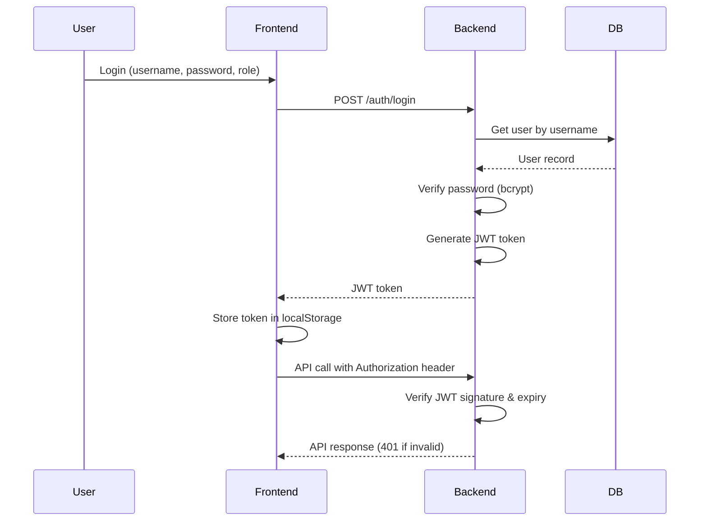
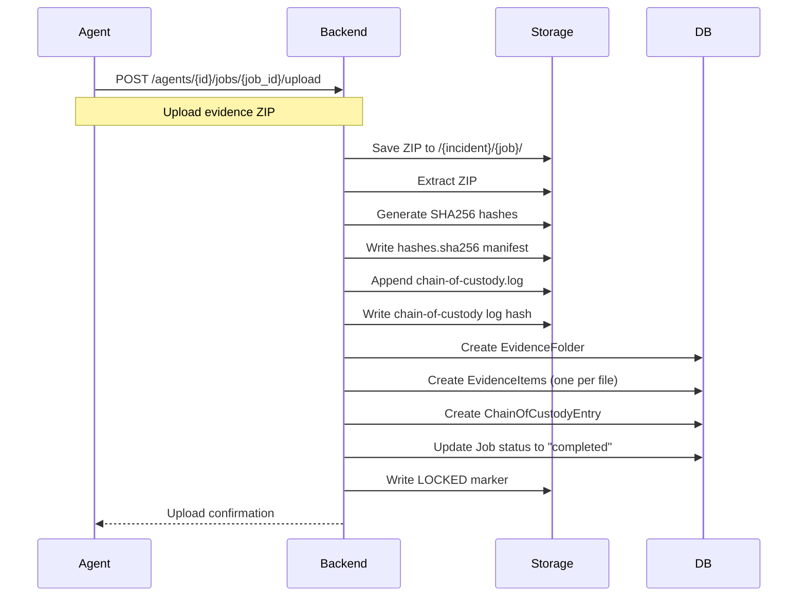
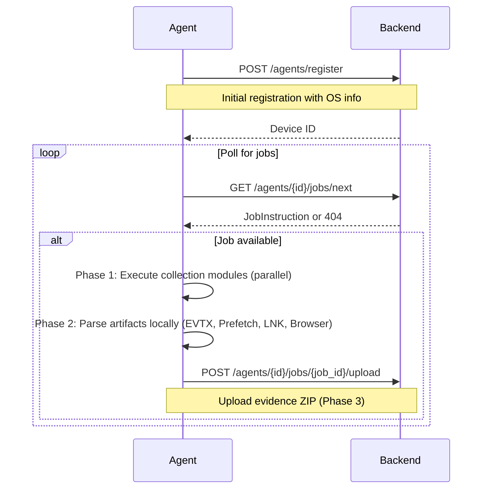

# Architecture Documentation

## System Overview

DFIR Rapid Collection Kit is a three-tier web application designed for secure evidence collection and incident response management.

```
┌──────────────────────────────────────────────────────────────────┐
│                           Presentation Layer                     │
│                      (React Frontend)                        │
│                                                              │
│  ┌──────────────┐  ┌──────────────┐  ┌─────────────────┐│
│  │   Incident   │  │   Evidence   │  │    Agent       ││
│  │ Management   │  │    Vault     │  │  Management     ││
│  └──────────────┘  └──────────────┘  └─────────────────┘│
└────────────────────────────┬─────────────────────────────────┘
                             │ HTTP/REST
                             ▼
┌──────────────────────────────────────────────────────────────────┐
│                           Application Layer                     │
│                      (FastAPI Backend)                        │
│                                                              │
│  ┌──────────────┐  ┌──────────────┐  ┌─────────────────┐│
│  │    Auth      │  │     API      │  │   Evidence     ││
│  │  & JWT       │  │   Router     │  │   Processing   ││
│  └──────────────┘  └──────────────┘  └─────────────────┘│
│                                                              │
│  ┌──────────────────────────────────────────────────────────┐  │
│  │            Business Logic (CRUD Layers)             │  │
│  │  Incidents | Evidence | ChainOfCustody | Jobs        │  │
│  └──────────────────────────────────────────────────────────┘  │
└────────────────────────────┬─────────────────────────────────┘
                             │ Async SQLAlchemy
                             ▼
┌──────────────────────────────────────────────────────────────────┐
│                           Data Layer                         │
│                        (PostgreSQL 16)                       │
│                                                              │
│  ┌──────────────┐  ┌──────────────┐  ┌─────────────────┐│
│  │   Incidents  │  │   Devices    │  │      Jobs      ││
│  │    Users     │  │  Collectors  │  │  Evidence      ││
│  │   Templates  │  │              │  │  ChainOfCustody││
│  └──────────────┘  └──────────────┘  └─────────────────┘│
└──────────────────────────────────────────────────────────────────┘
                              │
                              ▼
┌──────────────────────────────────────────────────────────────────┐
│                       File System                           │
│                   (Evidence Storage)                          │
│                                                              │
│  /vault/evidence/                                             │
│    ├── {incident_id}/                                          │
│    │   ├── {job_id}/                                          │
│    │   │   ├── collection.zip                                  │
│    │   │   ├── extracted/                                       │
│    │   │   ├── hashes.sha256                                    │
│    │   │   ├── chain-of-custody.log                             │
│    │   │   └── LOCKED                                          │
│    │   └── exports/                                            │
│    │       └── {incident_id}-{timestamp}.zip                    │
└──────────────────────────────────────────────────────────────────┘
```

## Frontend Architecture

### Directory Structure

```
frontend/
├── public/                 # Static assets
├── src/
│   ├── components/
│   │   ├── layout/       # AppLayout, Sidebar
│   │   ├── ui/           # shadcn/ui components
│   │   ├── common/       # Shared components
│   │   └── *.tsx         # Feature components
│   ├── pages/            # Route pages (Dashboard, CreateIncident, CollectionSetup,
│   │                     # CollectionExecution, IncidentHub, ProcessingStatus,
│   │                     # SigmaHits, IOCMatches, YaraMatches, SuperTimeline, etc.)
│   ├── hooks/            # React hooks
│   ├── lib/              # Utilities, API client
│   ├── types/            # TypeScript types
│   ├── App.tsx
│   └── main.tsx
├── Dockerfile
├── package.json
├── tailwind.config.ts
├── tsconfig.json
└── vite.config.ts
```

### Key Components

**AppLayout**: Main layout with sidebar, header, and footer
**AppSidebar**: Navigation menu with incident/collector stats
**WarningBanner**: Critical alerts for collection in progress
**TacticalPanel**: Consistent panel styling for DFIR aesthetic
**IncidentHub**: Per-incident command center with metadata, quick actions, analysis progress, lateral movement summary

### API Client Pattern

```typescript
// Use helpers from src/lib/api.ts — they inject the Bearer token automatically
// and redirect to /login on 401. Auth token is stored in localStorage["dfir_auth"]
// as { token: string }; role and username are decoded from the JWT payload.
import { apiGet, apiPost, apiPatch, apiDelete } from "@/lib/api";

const incident = await apiGet<IncidentOut>(`/incidents/${id}`);
await apiPost("/incidents", payload);
```

## Backend Architecture

### Directory Structure

```
backend/
├── alembic/                # Database migrations
│   ├── versions/
│   ├── env.py
│   └── script.py.mako
├── app/
│   ├── api/
│   │   └── v1/
│   │       ├── api.py      # Router aggregation
│   │       └── endpoints/  # Route handlers
│   │           ├── agents.py
│   │           ├── audit_logs.py
│   │           ├── auth.py
│   │           ├── chain_of_custody.py
│   │           ├── collectors.py
│   │           ├── devices.py
│   │           ├── evidence.py      # Evidence vault + super-timeline query/export
│   │           ├── incidents.py
│   │           ├── jobs.py
│   │           ├── processing.py    # Forensics pipeline trigger, sigma/yara/ioc/attack-chains
│   │           ├── settings.py
│   │           ├── status.py        # /health (public) + /diagnostics (admin+)
│   │           ├── templates.py
│   │           └── users.py
│   ├── core/
│   │   ├── config.py       # Environment settings
│   │   ├── deps.py         # FastAPI dependencies (require_roles factory)
│   │   ├── security.py     # JWT, hashing, HMAC export signatures
│   │   ├── evidence_files.py # File operations
│   │   └── modules.py      # Module registry + collection profiles
│   ├── crud/                # Database operations
│   │   ├── chain_of_custody.py
│   │   ├── device.py
│   │   ├── evidence.py
│   │   ├── evidence_export.py
│   │   ├── incident.py
│   │   ├── job.py
│   │   ├── super_timeline.py
│   │   ├── template.py
│   │   └── user.py
│   ├── db/
│   │   ├── base.py         # SQLAlchemy Base
│   │   └── session.py      # AsyncSession factory
│   ├── models/              # ORM models
│   │   ├── audit_log.py
│   │   ├── chain_of_custody.py
│   │   ├── collector.py
│   │   ├── device.py
│   │   ├── evidence.py
│   │   ├── incident.py
│   │   ├── job.py
│   │   ├── processing.py    # ProcessingJob, SigmaHit, YaraMatch, IOCMatch, AttackChain
│   │   ├── settings.py
│   │   ├── super_timeline.py # SuperTimeline, LateralMovement
│   │   ├── template.py
│   │   └── user.py
│   ├── schemas/             # Pydantic models
│   │   ├── auth.py
│   │   ├── chain_of_custody.py
│   │   ├── device.py
│   │   ├── evidence.py
│   │   ├── job.py
│   │   ├── settings.py      # SystemSettingsApiOut masks timesketch_token as "***"
│   │   ├── status.py
│   │   ├── template.py
│   │   └── user.py
│   ├── services/
│   │   ├── audit_log_service.py      # Hash-chained API event log
│   │   ├── report_service.py         # Incident report generation
│   │   ├── super_timeline_service.py # Cross-host timeline merge → DuckDB
│   │   └── system_settings_service.py # Settings cache (60s TTL)
│   ├── seed.py              # Seed data (no hardcoded passwords)
│   ├── seed_run.py          # DB initialization
│   ├── worker.py            # Celery app + task definitions
│   └── main.py             # FastAPI app (security middleware, CORS, startup checks)
├── requirements.txt
├── Dockerfile
└── alembic.ini
```

### Authentication Flow



### Evidence Processing Pipeline



### Chain of Custody Integrity

The chain-of-custody uses cryptographic hashing to ensure tamper evidence:

1. **Sequence**: Each entry has a monotonically increasing `sequence` number
2. **Chaining**: Each entry's `entry_hash` depends on:
   - Incident ID
   - Sequence number
   - Timestamp
   - Action
   - Actor
   - Target
   - Previous entry's `entry_hash`

3. **Verification**: On read, backend verifies the chain:
   ```python
   for entry in entries:
       expected_hash = compute_chain_hash(
           entry.incident_id,
           entry.sequence,
           entry.timestamp,
           entry.action,
           entry.actor,
           entry.target,
           previous_hash,
       )
       assert entry.entry_hash == expected_hash
       assert entry.previous_hash == previous_hash
   ```

Any tampering with a CoC entry will cause verification to fail.

**API Endpoints**

- `GET /api/v1/chain-of-custody` (optional `incident_id` filter)
- `POST /api/v1/chain-of-custody` (operator/admin create entry)
- `GET /api/v1/chain-of-custody/export` (CSV export, optional `incident_id`)

## Agent Architecture (Go)

### Agent Workflow



### Agent Execution Phases

The agent executes collections in three distinct phases:

**Phase 1 — Artifact Collection**
- Executes all selected modules in parallel (goroutine pool, default 4 concurrent workers)
- Modules run independent of each other; failure of one does not stop others
- Status sent to backend: `"collecting"` or `"collecting (N/M)"` for progress
- Output files placed in workdir under module-specific paths

**Phase 2 — Local Parsing**
- After all modules complete, the `parsers` package processes collected artifacts
- Converts binary/structured data to more useful formats:
  - EVTX logs → JSONL via `wevtutil.exe` (Windows only)
  - Prefetch files → CSV (binary parser with MAM decompression support)
  - LNK shell links → CSV (binary parser)
  - Browser History (Chrome/Edge/Firefox) → CSV (pure-Go SQLite parser)
- Parsed output placed in `workdir/parsed/` subdirectories
- Status sent to backend: `"parsing"`
- Parsing failures do not prevent upload; partial results are still collected

**Phase 3 — ZIP + Upload**
- Agent compresses entire workdir (including parsed/ subdirectory) into `collection.zip`
- Uploads ZIP to `/agents/{id}/jobs/{job_id}/upload` endpoint
- Status sent to backend: `"uploading"` then `"complete"`
- Backend receives, extracts, hashes, appends chain-of-custody, and locks folder

### Parser Package

The `agent/internal/parsers/` package provides on-device evidence processing:

- **EVTX Parser**: Uses Windows `wevtutil.exe` to convert event logs to JSONL
- **Prefetch Parser**: Binary parser for Windows Prefetch files; supports MAM version 8 decompression
- **LNK Parser**: Binary parser for Shell Link (.lnk) files; outputs to CSV
- **Browser History Parser**: Pure-Go SQLite implementation for Chrome, Firefox, and Edge history databases

Benefits of on-device parsing:
- Reduces network bandwidth (parsed formats are smaller)
- Enables offline collection (parsing happens before upload)
- Increases agent speed (parsing in parallel with next job polling)
- Provides intermediate formats for backend pipeline

### JobInstruction Schema

```json
{
  "job_id": "JOB-2025-0001",
  "incident_id": "INC-2025-0142",
  "os": "windows",
  "work_dir": "/tmp/dfir-collection-12345",
  "modules": [
    {
      "module_id": "windows_eventlog_security",
      "output_relpath": "logs/windows/security.evtx",
      "params": {"time_window": "7d"}
    },
    {
      "module_id": "windows_process_list",
      "output_relpath": "volatile/windows/process_list.csv",
      "params": {}
    }
  ],
  "collection_timeout_min": 60,
  "concurrency_limit": 4,
  "retry_attempts": 3
}
```

The backend may include `collection_timeout_min`, `concurrency_limit`, and `retry_attempts` to bound overall collection time, control worker pool size, and guide agent-side retry behavior.

### Module Registry

```python
MODULE_REGISTRY = {
    "windows_eventlog_security": {
        "os": "windows",
        "category": "logs",
        "output_relpath": "logs/windows/security.evtx",
    },
    "windows_process_list": {
        "os": "windows",
        "category": "volatile",
        "output_relpath": "volatile/windows/process_list.csv",
    },
    "linux_journalctl": {
        "os": "linux",
        "category": "logs",
        "output_relpath": "logs/linux/journalctl.log",
    },
}
```

**Important:** The Python `MODULE_REGISTRY` in `backend/app/core/modules.py` must be kept in sync manually with the Go module implementations in `agent/internal/modules/`. There is no automatic synchronization mechanism.

### Super Timeline Feature

The Super Timeline feature enables cross-host evidence correlation and threat detection:

**Models** (`backend/app/models/super_timeline.py`):
- `SuperTimeline`: Stores individual parsed timeline events with DuckDB persistence
- `LateralMovement`: Detects and tracks lateral movement between hosts based on timeline correlation

**Service** (`backend/app/services/super_timeline_service.py`):
- Merges per-host `timeline.jsonl` files into a unified DuckDB database
- Automatically triggered after forensics pipeline completes
- Supports full-text search, filtering by source and date range

**Query Endpoint** (`GET /api/v1/evidence/super-timeline/{incident_id}`):
- Supports filters: `q` (full-text search), `source`, `date_from`, `date_to`, `hosts`, `sort_by`, `sort_dir`
- Returns paginated results with `total_pages` and `source_shorts` for display
- Whitelist of sortable columns prevents injection

**Export Endpoint** (`GET /api/v1/evidence/super-timeline/{incident_id}/export`):
- Formats: `csv` or `jsonl`
- Downloads all matching rows as a single file

**Frontend Page** (`frontend/src/pages/SuperTimeline.tsx`):
- Filter panel (quick filters, source chips, date range picker)
- Highlight search terms in results
- Column visibility toggle (persisted to localStorage)
- Export dropdown (CSV/JSONL)
- Responsive table with sorting and pagination

**Lateral Movement Detection**:
- Identifies connections between hosts in the timeline
- Surfaces suspicious patterns (e.g., A → B → C lateral movement chains)
- Displayed in Incident Hub and detailed analysis pages

## Docker Architecture

### Service Composition

```yaml
services:
  db:              # PostgreSQL 16
    ports: [5432:5432]
    volumes: [dfir_postgres:/var/lib/postgresql/data]

  redis:           # Redis 7
    ports: [6379:6379]

  backend:         # FastAPI + uvicorn
    build: ./backend
    ports: [8000:8000]
    environment:
      DATABASE_URL: postgresql+asyncpg://...
      SECRET_KEY: ${SECRET_KEY}
    volumes: [dfir_evidence:/vault/evidence]
    depends_on:
      db:
        condition: service_healthy

  celery_worker:   # Celery background tasks
    build: ./backend
    environment:
      DATABASE_URL: postgresql+asyncpg://...
    volumes: [dfir_evidence:/vault/evidence]
    depends_on:
      - backend
      - redis

  frontend:        # Nginx + React build
    build: ./frontend
    ports: [5173:5173]
    depends_on:
      backend:
        condition: service_healthy
```

### Network Topology

```
┌────────────────────────────────────────────────┐
│                Host Machine                    │
│                                                │
│  ┌────────────────────────────────────────────┐│
│  │         docker0 (Bridge Network)           ││
│  │                                            ││
│  │  ┌──────────┐ ┌──────────┐ ┌─────────┐   ││
│  │  │   db     │ │ backend  │ │frontend ││   ││
│  │  │ :5432    │ │ :8000    │ │ :5173   ││   ││
│  │  └──────────┘ └──────────┘ └─────────┘   ││
│  └────────────────────────────────────────────┘│
│                                                │
│  ┌────────────────────────────────────────────┐│
│  │   Volumes (Named)                          ││
│  │   dfir_postgres: /var/lib/...              ││
│  │   dfir_evidence: /vault/evidence           ││
│  └────────────────────────────────────────────┘│
└────────────────────────────────────────────────┘

Access:
- Frontend: http://localhost:5173
- Backend API: http://localhost:8000
- Database: localhost:5432
```

## Security Model

### Authentication

1. **User Authentication**:
   - Password hashing with bcrypt
   - JWT tokens with configurable expiry
   - Token storage in `localStorage` (httpOnly cookies recommended for production)

2. **Agent Authentication**:
   - Shared secret via `X-Agent-Token` header (compared with `hmac.compare_digest`)
   - Required for job polling, status updates, and uploads
   - Empty `AGENT_SHARED_SECRET` causes backend startup failure (RuntimeError)

### Authorization

Role-based access control (RBAC):

| Role       | Incidents | Templates | Devices | Evidence | Settings | Users |
|------------|----------|-----------|---------|----------|----------|-------|
| Admin      | CRUD     | CRUD      | CRUD    | CRUD     | CRUD     | CRUD  |
| Operator   | CRU      | CRU       | CRU     | CR       | Read     | -     |
| Viewer     | Read     | Read      | Read    | Read     | Read     | -     |

### Security Headers

`SecurityHeadersMiddleware` in `main.py` adds the following headers to every response:

| Header | Value |
|--------|-------|
| `X-Content-Type-Options` | `nosniff` |
| `X-Frame-Options` | `DENY` |
| `X-XSS-Protection` | `1; mode=block` |
| `Referrer-Policy` | `strict-origin-when-cross-origin` |
| `X-Permitted-Cross-Domain-Policies` | `none` |
| `Permissions-Policy` | `geolocation=(), camera=(), microphone=()` |
| `Content-Security-Policy` | `default-src 'none'; frame-ancestors 'none'` |

CORS is restricted to explicit method and header whitelists (no wildcards).

The Nginx frontend container adds a broader CSP suitable for the SPA (`script-src 'self' 'unsafe-inline'`, `connect-src 'self' ...`).

### Input Validation

- Pydantic schemas for all request/response bodies
- Path traversal prevention in evidence storage
- File upload size limits (`MAX_UPLOAD_SIZE_MB`)
- Identifier validation (alphanumeric, underscore, dash, dot; max 256 chars)
- `severity` query param whitelisted against `_ALLOWED_SEVERITIES` set in `processing.py`

### Evidence Integrity

- SHA256 hashing for all evidence files
- Append-only chain-of-custody logs
- Chain verification on read (returns 409 if corrupted)
- Locked evidence folders (append-only after collection)
- Evidence export downloads require a signature query param generated on export

## Deployment Patterns

### Development

```bash
# Backend
cd backend
python -m venv .venv
source .venv/bin/activate
pip install -r requirements.txt
cp .env.example .env
python -m app.seed_run
uvicorn app.main:app --reload --port 8000

# Frontend
cd frontend
npm install
cp .env.example .env
npm run dev
```

### Production (Docker)

```bash
# Build images
docker compose build

# Start services
docker compose up -d

# View logs
docker compose logs -f backend
```

### Production Considerations

1. **Reverse Proxy**: Use Nginx/Traefik for SSL termination
2. **Database Backups**: Regular PostgreSQL dumps
3. **Evidence Backups**: Offsite backups of `/vault/evidence`
4. **Monitoring**: Add health checks, metrics, and logging aggregation
5. **Secrets Management**: Use proper secrets manager (Vault, AWS Secrets Manager)

## Scalability

### Horizontal Scaling

- **Frontend**: Stateless, can scale behind load balancer
- **Backend**: Stateless, can run multiple instances
- **Database**: Use managed PostgreSQL with read replicas
- **Evidence Storage**: Use S3-compatible object storage

### Vertical Scaling

- **Backend**: Increase CPU/RAM for heavy evidence processing
- **Database**: Increase connection pool size
- **Storage**: Use faster SSDs for evidence I/O
